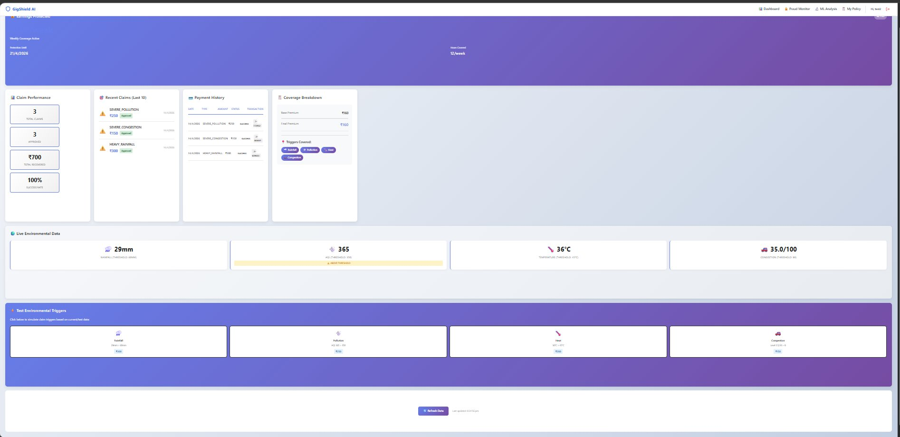
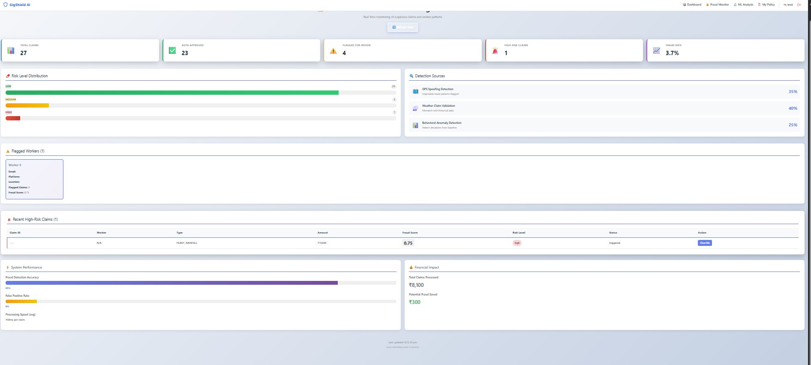
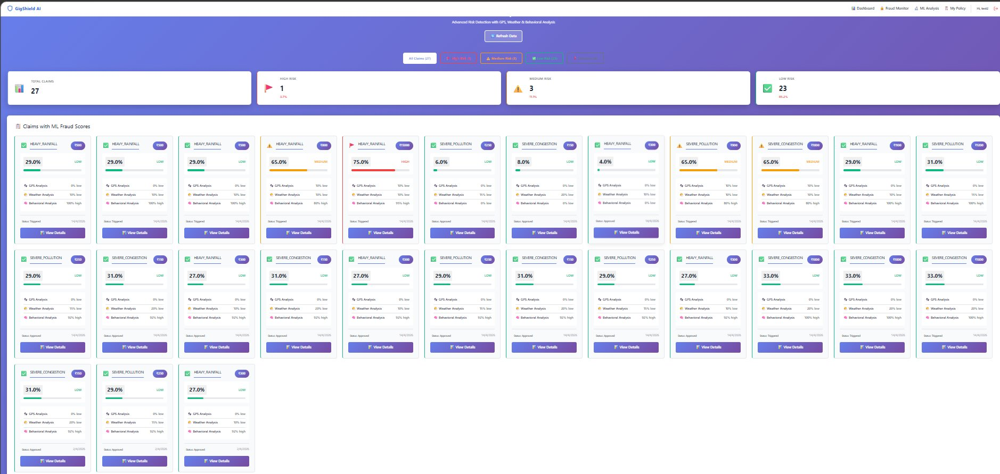
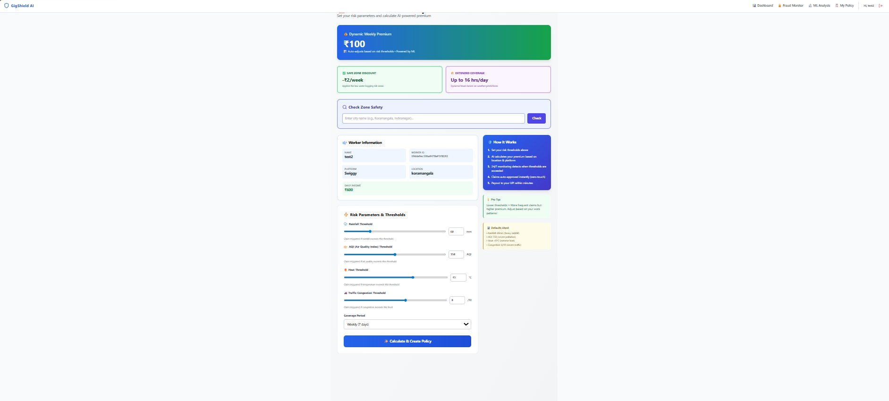

# GigShield AI 🛡️
### AI-Powered Parametric Insurance for Gig Workers

[](LICENSE)
[](#)
[](#)
[](#)

> Protecting gig delivery workers from income loss — automatically, instantly, and intelligently.

---

## 🚨 The Problem

India has **10M+ gig delivery workers** (Swiggy, Zomato, Zepto, Amazon) with zero income protection. When external conditions make it impossible or unsafe to work, they simply lose money — with no recourse.

**Income killers for gig workers:**
- 🌧️ Heavy rainfall & flooded roads
- 💨 Severe air pollution (high AQI)
- 🔥 Extreme heat
- 🚗 Traffic congestion
- ⛔ Government curfews

There is **no automated insurance system** that protects them instantly. Until now.

---

## 💡 The Solution

GigShield AI is a **parametric insurance platform** that monitors real-world environmental conditions and triggers automatic compensation — no manual claims, no paperwork, no waiting.

**Example:** Rahul (26) delivers for Swiggy and earns ₹700/day. When heavy rain hits and orders dry up, GigShield detects the trigger and automatically sends him ₹300 via UPI — in under 5 seconds.

---

## ✨ Key Features

### ⚡ Parametric Auto-Triggers
Claims fire automatically when real-world thresholds are crossed:

| Trigger | Threshold | Payout |
|--------|-----------|--------|
| 🌧️ Rainfall | > 60mm | ₹300 |
| 💨 Air Quality (AQI) | > 350 | ₹250 |
| 🔥 Temperature | > 45°C | ₹200 |
| 🚗 Traffic Congestion | > 8/10 | ₹150 |
| ⛔ Curfew Active | Detected | ₹500 |

### 🤖 AI Dynamic Pricing
Premiums are personalized based on:
- 📍 Location risk score
- 🌦️ Historical weather patterns
- 💨 Pollution data
- 🌊 Flood probability

| Risk Level | Weekly Premium |
|------------|---------------|
| 🟢 Low | ₹10/week |
| 🟡 Medium | ₹20/week |
| 🔴 High | ₹30/week |

### 🔍 Three-Layer Fraud Detection
GigShield uses an ensemble ML pipeline to prevent abuse:

1. **GPS Spoofing Detection** — flags impossible travel patterns and location mismatches
2. **Weather Claim Validation** — cross-checks claims against historical weather data (>92% accuracy)
3. **Behavioral Anomaly Detection** — uses Isolation Forest to catch unusual claim patterns

**Combined accuracy:** >92% precision, >85% recall

### 💸 Zero-Touch Payout System
```
Trigger Detected → Policy Verified → Fraud Check (3 models) → Auto-Approved → UPI Payout
                                                                    ⏱️ Total: < 5 seconds
```

---

## 📸 Screenshots

### 🖥️ Worker Dashboard
> Live environmental monitoring, claim history, payment tracking, and trigger simulation



---

### 🔐 Fraud Monitor
> Real-time fraud risk distribution, detection source breakdown, and flagged worker review



---

### 🤖 ML Analysis — Claims with Fraud Scores
> Every claim scored across GPS, Weather, and Behavioral models with risk classification



---

### 📋 My Policy — AI Premium Calculator
> Set custom risk thresholds, check zone safety, and get an AI-calculated weekly premium



---

## 🏗️ Architecture

```
┌─────────────────────┐
│   React Frontend    │  ← Worker & Admin Dashboards
│   Port: 3000        │
└──────────┬──────────┘
           │ REST API
           ↓
┌─────────────────────┐
│  Node.js Backend    │  ← Business Logic, Claims, Payments
│  Port: 5000         │
└──────┬──────────────┘
       │              │
       ↓              ↓
┌──────────────┐  ┌──────────────────┐
│   MongoDB    │  │  Python ML Server │
│  Port: 27017 │  │  Port: 5001       │
└──────────────┘  └──────────────────┘
```

---

## 🛠️ Tech Stack

| Layer | Technology |
|-------|-----------|
| **Frontend** | React.js, Tailwind CSS, Axios |
| **Backend** | Node.js, Express.js, Mongoose |
| **Database** | MongoDB |
| **AI/ML** | Python, Scikit-learn, Random Forest, SVM, Isolation Forest |
| **Payments** | UPI Simulator (Razorpay-ready) |
| **APIs** | OpenWeatherMap, AQI API |

---

## 🚀 Getting Started

### Prerequisites

| Tool | Version |
|------|---------|
| Node.js | 16.0+ |
| Python | 3.8+ |
| MongoDB | 5.0+ |

### Installation

```bash
# 1. Clone the repository
git clone https://github.com/YOUR_USERNAME/GigShield-AI.git
cd GigShield-AI
```

Open **4 separate terminals** and run:

**Terminal 1 — MongoDB**
```bash
mongod
```

**Terminal 2 — Backend**
```bash
cd backend
npm install
node server.js
```

**Terminal 3 — ML Models**
```bash
cd ai_models
pip install -r requirements.txt
python train_ml_models.py   # Run once to train models
python app.py
```

**Terminal 4 — Frontend**
```bash
cd frontend
npm install
npm start
```

### Access the App

| Service | URL |
|---------|-----|
| Frontend | http://localhost:3000 |
| Backend API | http://localhost:5000 |
| ML Server | http://localhost:5001 |

### Verify Setup

```bash
curl http://localhost:5000/api/health   # Backend
curl http://localhost:5001/api/status   # ML Server
```

---

## 🧪 Demo Walkthrough

1. **Register** a worker (name, platform, UPI ID)
2. **Create a policy** — system calculates your risk-based premium
3. **View your dashboard** — live environmental triggers, coverage details, claim history
4. **Trigger a claim** — click any environmental trigger; watch it auto-approve in <5 seconds
5. **Admin view** — explore the fraud dashboard, portfolio health, and predictive analytics

---

## 📊 ML Models

| Model | Algorithm | Purpose | Accuracy |
|-------|-----------|---------|----------|
| Premium Calculator | Random Forest | Dynamic pricing | MAE < ₹3 |
| GPS Fraud Detector | SVM Anomaly Detection | Location spoofing | >92% |
| Weather Validator | Historical Comparison Engine | Fake weather claims | >92% |
| Behavioral Detector | Isolation Forest | Unusual claim patterns | >85% recall |

---

## 📁 Project Structure

```
GigShield-AI/
├── frontend/          # React app — worker & admin dashboards
├── backend/           # Node.js API server
│   └── services/
│       └── upiSimulator.js
├── ai_models/         # Python ML models
│   ├── fraud_detection_gps.py
│   ├── fraud_detection_weather.py
│   ├── fraud_detection_behavioral.py
│   ├── premium_model.py
│   └── train_ml_models.py
├── data/              # Sample datasets
├── docs/              # Documentation
└── README.md
```

---

## 🔒 Security

- Password hashing
- Input validation
- Duplicate claim prevention (24-hour window)
- Three-layer fraud detection on every claim

---

## 📈 Business Model

| Metric | Value |
|--------|-------|
| Weekly Premium | ₹10–₹30 |
| Processing Time | < 5 seconds |
| Fraud Detection | > 92% accuracy |
| Target Market | 10M+ gig workers in India |
| Operational Cost | Minimal (fully automated) |

---

## 🔮 Roadmap

- [ ] Mobile app (React Native)
- [ ] Real OpenWeatherMap & Razorpay integration
- [ ] WhatsApp claim alerts
- [ ] Blockchain payout verification
- [ ] LSTM-based behavioral fraud detection
- [ ] Zone-based & hourly premium tiers

---

## 🤝 Contributing

1. Fork the repository
2. Create your feature branch (`git checkout -b feature/YourFeature`)
3. Commit your changes (`git commit -m 'Add YourFeature'`)
4. Push to the branch (`git push origin feature/YourFeature`)
5. Open a Pull Request

---

## 📄 License

This project is licensed under the [MIT License](LICENSE).

---

## 👥 Team

**SYSTEM-SQUAD — DevTrails 2026**

Built with ❤️ for India's gig workforce.
